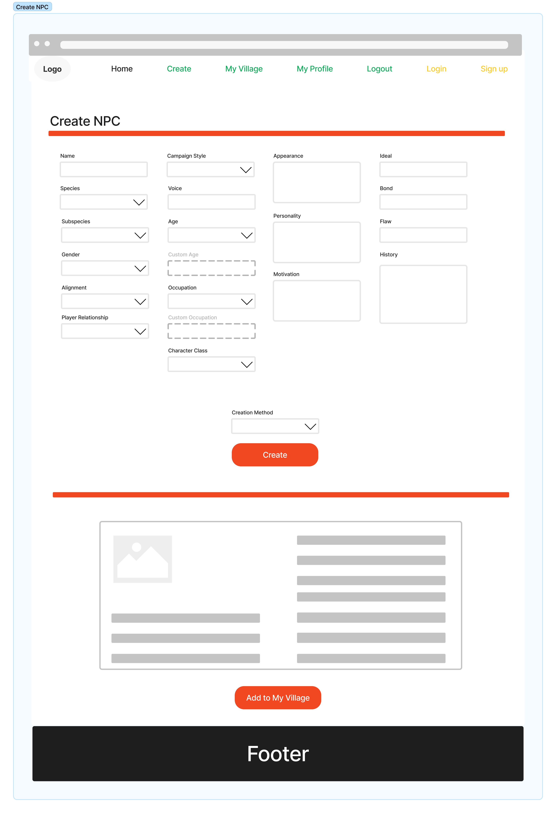

# NPC Village

Introducing NPC Village - your ultimate tool for Dungeons and Dragons campaign management! With our pioneering digital platform, you can effortlessly generate Non-Player Characters (NPCs) that add depth and intrigue to your game world.

No more spending countless hours crafting characters and their intricate backstories. NPC Village, powered by the advanced AI of ChatGPT, makes it a cinch to create compelling characters that enhance your campaign and captivate your players. Whether you need a villainous mastermind, a cryptic oracle, or a humble tavern-keeper, our platform has you covered.

So what are you waiting for? Join today and experience a whole new world of campaign creation!

## Wireframes of NPC Village

### Home

### Login

### Signup

### My Profile

### Create NPC

### My Village

### Our Team Page

## Project Management

[Location of Project Management Board](https://github.com/orgs/npc-villagers/projects/1)

## Domain Model

## Database Schema

## Team Members

- Alex Carr
- Dasha Burgos
- Davey Oswald
- Matt Austin
- Ryan Apodaca
