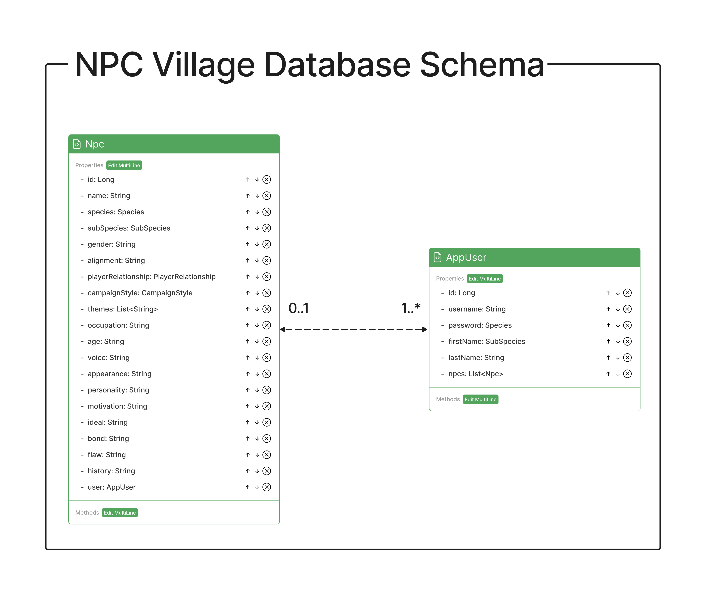

# Software Requirements

## Vision

Introducing NPC Village - your ultimate tool for Dungeons and Dragons campaign management! With our pioneering digital platform, you can effortlessly generate Non-Player Characters (NPCs) that add depth and intrigue to your game world.

No more spending countless hours crafting characters and their intricate backstories. NPC Village, powered by the advanced AI of ChatGPT, makes it a cinch to create compelling characters that enhance your campaign and captivate your players. Whether you need a villainous mastermind, a cryptic oracle, or a humble tavern-keeper, our platform has you covered.

So what are you waiting for? Join today and experience a whole new world of campaign creation!

## Scope

### IN

* User logs in and has access to their NPC Village
* Form to give the basic info that will be sent to Open AI that will generate a character
* Newly generated character displays on the page and can be saved or manually edited
* Exisiting characters in the the village can be edited or deleted

### OUT

* Cannot interact with Open AI with multiple requests
* Cannot edit what Open AI gives unless it is tracked down

### Minimum Viable Product

* A user is able to create an account to save their favorite NPCs
* A user can request a generated NPC based off of a number of criteria, e.g., species, profession, alignment, gender, campaign setting type
* A user can edit any property of a particular NPC

### Stretch Goals

* A user can group their saved NPCs into different groups and view their groups in their "Village"
* Incoproate DALLE to generate NPC portrait images
* Incorporate Cytoscape.js in the My Village page for visualization of NPC connections

## Functional Requirements

* A user can sign up to create a "village".
* The user can create characters within the village
* The user can edit the info for each character or delete character if it is not needed anymore

### Data Flow

This contains the ins/outs, functional requirements, and data flow of the app

## Non-Functional Requirements

* Security
    * Users that are logged in cannot access the village of other users
    * Implement WebSecurity to prevent cross-site scripting and SQL injections
    * Implement Open AI moderations endpoint to enforce proper usage
 
* Testing
    * Implement unit testing to ensure proper function on individual methods and objects
    * Integration tests to ensure different parts of the application work together as expected
    * Test to ensure data from Open AI returns as expected
